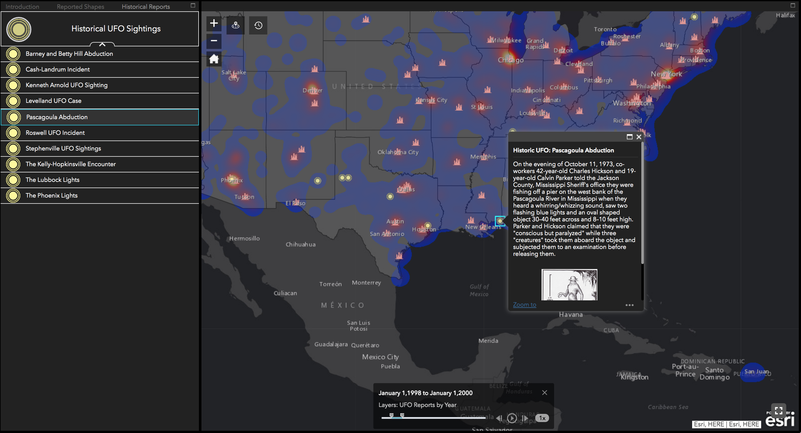

# UFO Sightings in the US


## Overview

This repo contains the script used to create the data used in the [UFO Sightings Web Application](https://esrisalesportal.maps.arcgis.com/apps/webappviewer/index.html?id=ddda71d5211f47e782b12f3f8d06246e). The script is under `src/main.py` and will output a `ufo-cleaned.csv` in the `data` directory. 

### Run with local environment

Install dependencies:

```bash
pip install -r requirements.txt
```

From the root `ufo-sightings` directory:

```bash
bash data/get_data.sh
```

This will download the data from the [original repo](https://github.com/planetsig/ufo-reports/tree/master/csv-data). 

To process the data (again, at the root of `ufo-sightings`):

```bash
python src/main.py --input_path=data/scrubbed.csv --output_path=data/ufo_sightings.csv
```

Done! The data is now cleaned to the point that it can be used in ArcGIS Online without much trouble. 

### Run with Docker

Running the script via Docker only requires that [Docker Desktop](https://www.docker.com/products/docker-desktop) is installed. All source data will be downloaded via `get_data.sh` and the directories will be made automatically.

In the root `ufo-sightings` directory:

```bash
docker build -t ufo_sightings .
docker container run -d -v $PWD:/ufo-sightings ufo_sightings
```

### Result

This ArcGIS Online web application was created using [ArcGIS Web AppBuilder](https://www.esri.com/en-us/arcgis/products/arcgis-web-appbuilder/overview) and uses a feature class made from the resulting `ufo-clean.csv` table:


